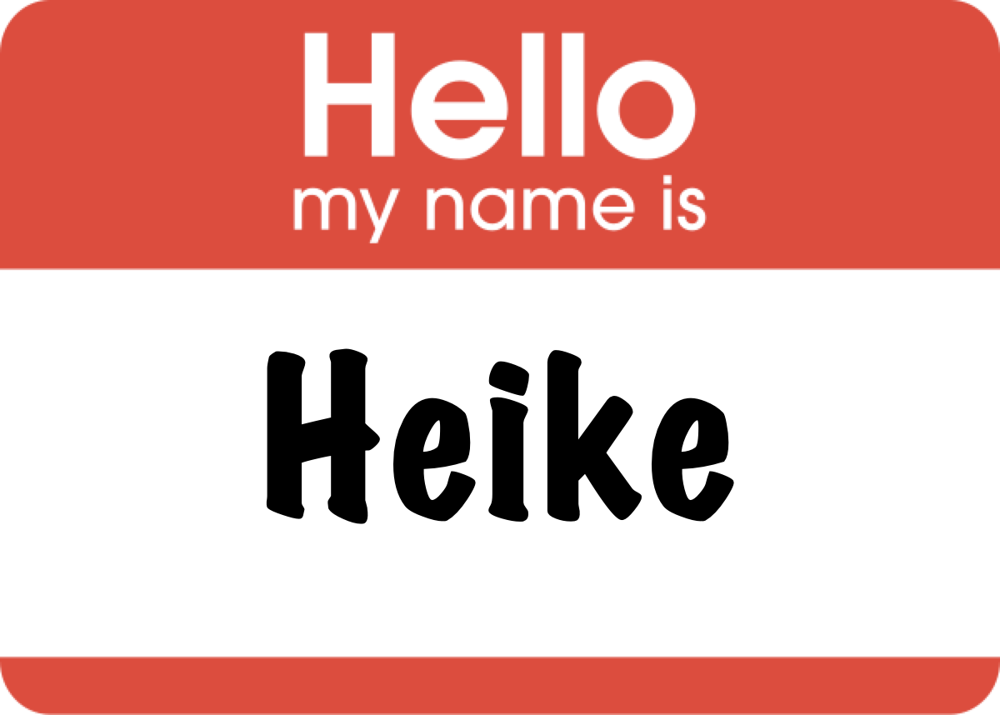
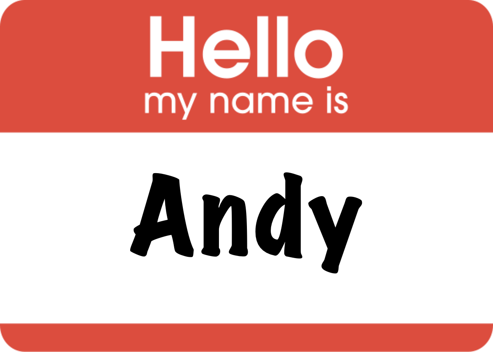
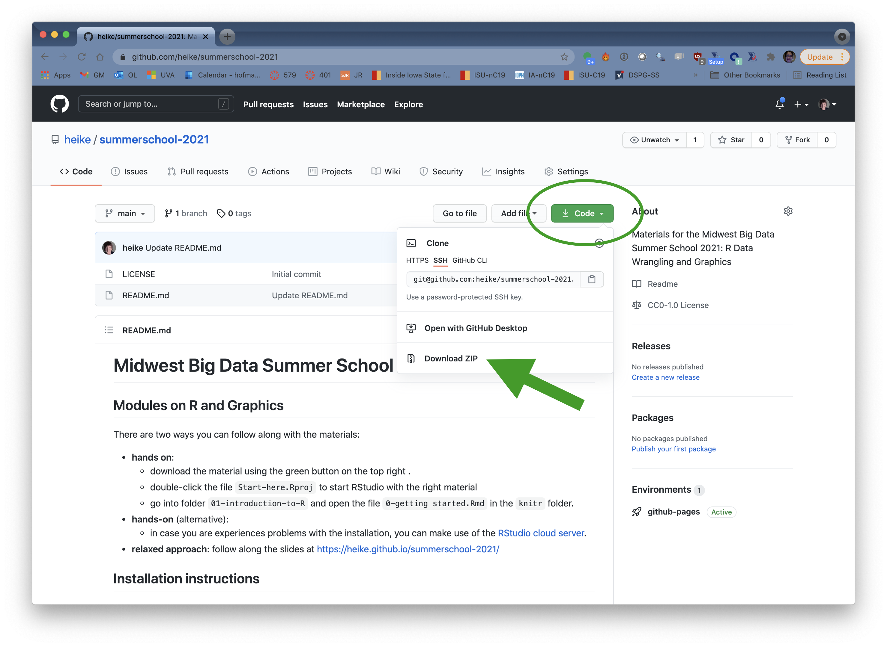
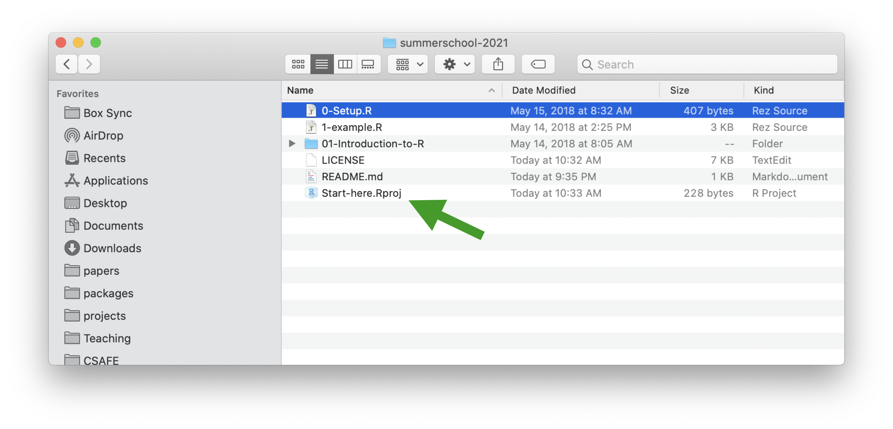
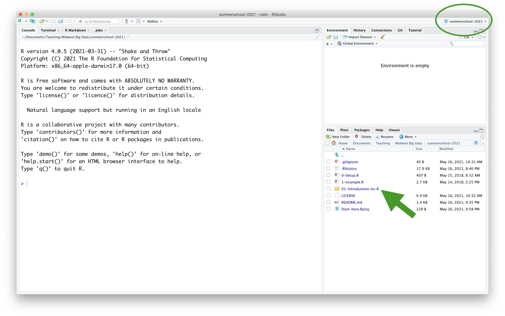

```{r setup, include = FALSE}
knitr::opts_chunk$set(
  message = FALSE,
  cache = FALSE,
  fig.height = 2,
  fig.width = 5,
  collapse = TRUE,
  comment = "#>"
)
```

##




##




## Programming with Data in R


1:00 - 2:20 
- Setup: Installation of R and RStudio

- First Example

- Some R basics

2:30 - 4:00

- the tidy verse

- examples with the tidyverse

# What is R? ... and what does it do?

## R  is ...

* <blockquote> a language and environment for statistical computing and graphics
</blockquote>
*  [20th annual poll on software for Analytics, Data Mining, Data Science, Machine Learning (kdnuggets)](https://www.kdnuggets.com/2019/05/poll-top-data-science-machine-learning-platforms.html) : "Which data mining/analytic tools you used in the past 12 months for a real project (not just evaluation)"
* R has a share of 46.6% versus python's 65.8%

* On average, data scientists use 6.1 tools in their daily work.

## R is ...

```{r, eval = TRUE, echo = FALSE}
pkgs <- data.frame(available.packages(contriburl = contrib.url("https://cran.rstudio.com/", "both")))
num_pkgs <- nrow(pkgs)
```

* __Free__ to use
* __Extensible__
    * `r num_pkgs` user contributed add-on packages currently on [CRAN](https://cran.r-project.org/) (The Comprehensive R Archive Network) (as of `r Sys.Date()`)
    * at least as many packages on github repositories
* __Powerful__
    * With the right tools, get more work done, faster.
* __Flexible__
    * Not a question of _can_, but _how_.
* __Frustrating__
    * Flexibility comes at a cost (easy to shoot yourself in the foot!).


## R does ...

* __Graphics, statistics, machine learning, etc.__
* __Data acquisition, munging, management__
* __Literate programming (dynamic reports)__
* __Web applications__

We will touch on all of these aspects.
Slides and material are available at
 http://heike.github.io/summerschool-2021


## Installing R

- Make sure to have R version 4.x.x installed

- Go to [http://www.r-project.org/](http://www.r-project.org/)
- Click the CRAN link on the left, and pick a download site (0-Cloud is a good choice)
- Choose link based on your OS
- On Windows, choose the "base" subdirectory to install R.
- On OS X, choose the .pkg file to install R.

## Installing RStudio

- RStudio 1.4.xxx supports both R and python 

- Browse to [https://www.rstudio.com/](https://www.rstudio.com/)
- Mouse over Products and click RStudio
- Choose RStudio Desktop
- Click Download RStudio Desktop
- Choose the installer appropriate for your platform


## RStudio is ...

- an excellent IDE for R (and python)

[From Julie Lowndes](http://jules32.github.io/resources/RStudio_intro/):  

<blockquote>
<b>If R were an airplane, RStudio would be the airport</b>, providing many, many supporting services that make it easier for you, the pilot, to take off and go to awesome places. Sure, you can fly an airplane without an airport, but having those runways and supporting infrastructure is a game-changer.
</blockquote>

## The RStudio IDE


## The RStudio IDE

<div class="columns-2">

1. Source editor
    - Docking station for multiple files
    - Useful shortcuts ("Knit")
    - Highlighting/Tab-completion
    - Code-checking (R, HTML, JS)
    - Debugging features

2. Console window
    - Highlighting/Tab-completion
    - Search recent commands

3. Other tabs/panes
    - Graphics
    - R documentation
    - Environment pane
    - File system navigation/access
    - Tools for package development, git, etc
<div>

## Following along

- Go to github [https://github.com/heike/summerschool-2021](https://github.com/heike/summerschool-2021) for all materials. 




## Starting RStudio



- Double-click the RStudio project `Start-here.Rproj`

## Projects in RStudio



- projects in RStudio allow easy start of an R session 
- keep track of all relevant files (R history, data, profile, ...)
- set the working directory to the current directory
- keep track of settings for next time ...

- ... double-click folder `01-Introducton-to-R`

## Navigate to the right file

- folder `code` contains R scripts (files ending with extension .R)
- folder `knitr` contains slides (files ending with extension .Rmd)


## Hello R Markdown!

* File -> New File -> R Markdown -> OK -> Knit HTML

<div align="center">
  
</div>

## What is R Markdown?

- From the [R Markdown home page](http://rmarkdown.rstudio.com/):

<blockquote>
R Markdown is an authoring format that enables easy creation of dynamic documents, presentations, and reports from R. It combines the core syntax of __markdown__ (an easy-to-write plain text format) __with embedded R code chunks__ that are run so their output can be included in the final document. R Markdown documents are fully reproducible (they can be automatically regenerated whenever underlying R code or data changes).
</blockquote>

- RStudio's [cheatsheet](https://www.rstudio.com/wp-content/uploads/2015/02/rmarkdown-cheatsheet.pdf) gives a nice, concise overview of its capabilities.

- RStudio's [reference guide](https://www.rstudio.com/wp-content/uploads/2015/03/rmarkdown-reference.pdf) lists its options.

