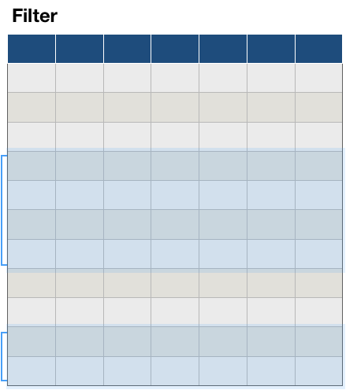
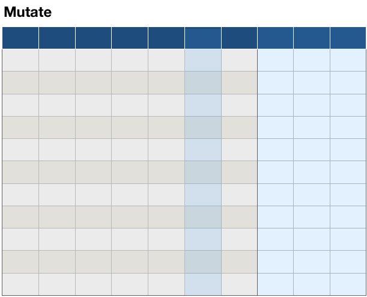
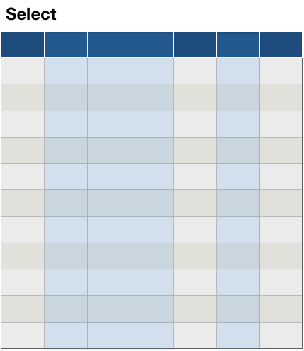
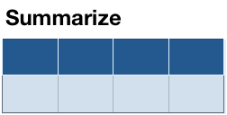
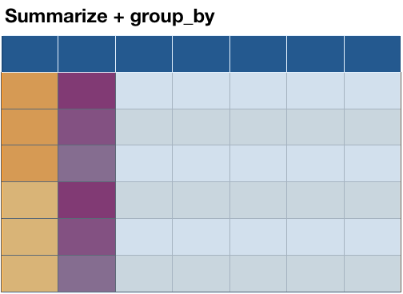

# Data management in R: the tidyverse 


---

# Outline

- elements of data management: filtering, sorting, and aggregations


- lots of examples

---

# `tidyverse`

`tidyverse` is a package bundling several other R packages:

- `ggplot2`, `dplyr`, `tidyr`, `purrr`, ...

- share common data representations and API, i.e. work well together

- from the [tidyverse manifesto](https://tidyverse.tidyverse.org/articles/manifesto.html):
  
    1. Reuse existing data structures.
    
    2. Compose simple functions with the pipe.
    
    3. Embrace functional programming.
    
    4. Design for humans.

- see https://github.com/hadley/tidyverse for more information

---

# `dplyr` 

There are a couple of primary `dplyr` *verbs*, representing distinct data analysis tasks:

- `filter`: Select specified rows of a data frame, produce subsets

- `mutate`: Add new or change existing columns of the data frame (as functions of existing columns)

- `arrange`: Reorder the rows of a data frame

- `select`: Select particular columns of a data frame

- `summarize`: Create collapsed summaries of a data frame

- `group_by`: Introduce structure to a data frame

---

# Common structure

all functions of the tidyverse have `data` as their first element

Important: do not use `$` notation for variables within these functions, e.g: 

```
ggplot(data = fbi, aes(x = Year, y = Count)) + 
  geom_point()
```


```
filter(fbi, Year >= 2017, State == "Iowa")
```


---

# `filter`

.pull-left[
select a subset of the observations (horizontal selection):

`filter (.data, ...)` 

specify constraints (as logical expression) to data in `...` 

all constraints are combined by logical and `&`
]

.pull-right[

]

.footnote[Make sure to always call `library(dplyr)` before using `filter`]

---

# `filter` Example

From the `fbi` data, extract all burglaries in 2016:

```{r, message=FALSE}
library(classdata)
library(dplyr)

fbi %>% filter(Type=="Burglary", Year==2016) %>% head()
```

---

# `mutate`

.pull-left[


`mutate (.data, ...)` 

Introduce new variables into the data set or transform/update  old variables

multiple variables can be changed/introduced

`mutate` works sequentially:
variables introduced become available in following changes
]

.pull-right[

]


---

# `mutate` Example

Introduce a variable `Rate` into the `fbi` data:

```{r}
fbi %>% mutate(Rate = Count/Population*70000) %>% head()
```


---

# `arrange`

`arrange` sorts a data set by the values in one or more variables

Successive variables break ties in previous ones

`desc` stands for descending, otherwise rows are sorted from smallest to largest

```{r, message=FALSE}
fbi %>% arrange(desc(Year), Type, desc(Count)) %>% head()
```

---

# `select`

.pull-left[
Select specific variables of a data frame (vertical selection):


`select (.data, ...)` 

specify all variables you want to keep

Variables can be selected by index, e.g. `1:5`, by name (don't use quotes), or using a selector function, such as 
`starts_with`

Negative selection also works, e.g. `-1` (not the first variable)
]

.pull-right[

]


---

# `select` Example


Select `Type, Count, State`, and `Year` from the `fbi` data:

```{r}
fbi %>% arrange(desc(Year), Type, desc(Count)) %>%
  select(Type, Count, State, Year) %>% head()
```

---
class: inverse
# Your turn

Use the `fbiwide` data set from the `classdata` package

Write out at least three different ways of selecting all variables describing incidences of different types of crimes

---

# `summarize`

.pull-left[


`summarize (.data, ...)` 

summarize observations into a (set of) one-number statistic(s):

Creates a new dataset with 1 row and one column for each of the summary statistics

]

.pull-right[

]


---

# `summarise` Example

Calculate the mean and standard deviation of Crime rates in the `fbi` data

```{r}
fbi %>% 
    summarise(mean_rate = mean(Count/Population*70000, na.rm=TRUE), 
              sd_rate = sd(Count/Population*70000, na.rm = TRUE))
```

---

# `summarize` and `group_by`

.pull-left[


Power combo! 


for each combination of group levels, create one row of a (set of) one-number statistic(s)

The new dataset has  one column for each of the summary statistics, and one row for each combination of grouping levels (multiplicative)

]

.pull-right[

]


---

# `summarise` and `group_by`

For each type of crime, calculate average crime rate and standard deviation.

```{r}
fbi %>%
    group_by(Type) %>%
    summarise(mean_rate = mean(Count/Population*70000, na.rm=TRUE), 
              sd_rate = sd(Count/Population*70000, na.rm = TRUE))
```

---
class: inverse, center, middle
# Let's use these tools


