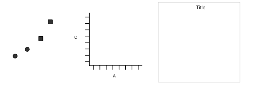

```{r setup, include = F}
library(tidyverse)
library(ggplot2)
library(dplyr)
library(tidyr)
library(gridExtra)
library(ggradar)
library(ggmosaic)
library(geomnet)
library(ggsci)
```

class: middle,center,inverse
# Motivation

---
class:inverse
background-color: #000


- Communication
- Ability to see the data can lead to new insights

???

When drawn well, statistical graphics help us understand our data and see things that we didn't know were there. The relationship between star magnitude, star color, and spectral class wasn't well understood until someone created a chart like this that showed the color index (or spectral class) against the absolute brightness. Then, it was much easier to see that the chart described a life-cycle - stars start out in the main sequence, and then become giants, dwarfs, or slowly change spectral class over time as they cool down in temperature.

Well designed graphs can help us understand the natural phenomenon behind the raw numerical data we've collected.

---
class: center, middle, inverse

# Overview: Types of Graphs

---

## Basic


.pull-left[
**One Variable**
- Discrete
  - Bar Chart
  - Pie Chart
  
- Continuous
  - Stem and Leaf Plots
  - Histograms
  
]

.pull-right[
**Two variables**
- Continuous X, Continuous Y
  - Scatterplots    
  (w/ and w/o trend lines)
  
- Maps
]


```{r beg, fig.height=4, fig.width=20, fig.pos="center", echo = F, message = F, warning = F}
data(mtcars)
p1 <- ggplot(mtcars, aes(factor(cyl), fill = factor(cyl))) + geom_bar() + labs(x="Cyl", title = "Bar Chart")+scale_fill_grey(start=0.2, end= 0.8, name = "cyl")+theme(legend.position = "none")
p2 <- ggplot(mtcars, aes(factor(1), fill = factor(cyl))) + geom_bar(width=1) + coord_polar(theta="y") + labs(x="", title = "Pie Chart")+scale_fill_grey(start=0.2, end= 0.8, name = "cyl")+theme(legend.position = "none")
p3 <- ggplot(iris, aes(Sepal.Length)) + geom_histogram(bins=20)+ labs(x="", title = "Histogram")
#p3 <- png("images/stem-and-leaf.png")
#p3
p4 <- ggplot(iris, aes(Sepal.Length, Sepal.Width)) + geom_point()+ labs(x="", y="", title = "Scatterplot")
data <- data.frame(murder=USArrests$Murder, state=tolower(rownames(USArrests)))
map <- map_data("state")
map2 <- map %>% filter(region == "iowa")
p5 <- data %>% filter(state == "iowa") %>% ggplot() + geom_map(aes(map_id=state), map=map2, fill = "grey33") + expand_limits(x = map2$long, y = map2$lat)+ labs(title = "Map")
grid.arrange(p1, p2, p3, p4, p5, ncol = 5, nrow = 1)
```

---
# More "Fancy"

.pull-left[
- Parallel Coordinate Plots
- Mosaic Plots
- Radar Charts
- Heat Maps
].pull-right[
- Density Plots
- Violin Plots
- Social Network Plots
]

```{r int, fig.height=4, fig.width=20, fig.pos="center", message = FALSE, warning = FALSE, echo =F}
iris2 <- iris %>% mutate(obs = 1:150) %>% pivot_longer(names_to = "variable", values_to = "value", -c(obs, Species)) 
#i1 <- ggplot()+ labs(x="", y="", title="Cartogram")
i2 <- ggplot(data = iris2) + 
 geom_line(aes(x = variable, y = value, group = interaction(Species, obs), color = Species)) + 
  #ggparcoord(data = iris, columns = 1:4, groupColumn = 5) +
  scale_colour_grey(start=0.2, end= 0.7) + 
  theme(legend.position = "none") + 
  labs(x="", y="", title="Parallel Coordinates")
i3 <- ggplot(diamonds) + 
  ggmosaic::geom_mosaic(aes(x=ggmosaic::product(color), fill = cut)) +
  scale_fill_grey(start=0.2, end= 0.7) + 
  theme(legend.position = "none") + labs(x="", y="", title="Mosaic Plot")
mtcars %>%
    tibble::rownames_to_column(var = "group") %>% 
     mutate(across(-1, scales::rescale)) %>%
     tail(4) %>% select(1:10) -> mtcars_radar
 i4 <- ggradar(mtcars_radar, group.line.width = .7,
   group.point.size = 2, axis.label.size = 3.5, grid.label.size = 2.5, background.circle.transparency = 0.1, plot.legend =FALSE)+scale_colour_grey(start=0.4, end= 0.9)+ theme(legend.position = "none") + labs(x="", y="", title="Radar Charts")
# i4 <- ggplot()+ labs(x="", y="", title="Radar Charts")
df.team_data <- expand.grid(teams = c("Team A", "Team B", "Team C", "Team D") ,metrics = c("Metric 1", "Metric 2", "Metric 3", "Metric 4", "Metric 5"))
# add variable: performance
set.seed(41)
df.team_data$performance <- rnorm(nrow(df.team_data))
i5 <-ggplot(data = df.team_data, aes(x = metrics, y = teams)) +
  geom_tile(aes(fill = performance)) + scale_fill_distiller(palette = "Greys")+ theme(legend.position = "none") + labs(x="", y="", title="Heat Map")
grid.arrange(i2, i3, i4, i5, ncol = 4, nrow = 1)

a1 <- ggplot(diamonds, aes(depth)) +
    geom_density(aes(fill = cut), alpha = .8) +
    xlim(55, 70) + labs(x="", y="", title="Density Plot")+scale_colour_grey(start=0.6, end= 0.9)+scale_fill_grey(start=0.6, end= 0.9) + theme(legend.position = "none")
a2 <- ggplot(diamonds, aes(cut, price)) + geom_violin(aes(fill = cut), alpha = .8) + labs(x="", y="", title="Violin Plot")+scale_fill_grey(start=0.6, end= 0.9) + theme(legend.position = "none")

data(blood)
a3 <- ggplot(data = blood$edges, aes(from_id = from, to_id = to)) +
  geom_net(vertices=blood$vertices, aes(colour=..type..)) + 
  theme_net() +scale_colour_grey(start=0.4, end= 0.9)+ theme(legend.position = "none") + labs(x="", y="", title="Network Plot")
grid.arrange(a1, a2, a3, ncol = 3, nrow = 1)
```

---
## `ggplot2`: Grammar of Graphics in R

- Wildly popular package for statistical graphics: over 2.5 million downloads from CRAN in 2017 (several thousand times per day)
- Developed by Hadley Wickham (An ISU Alumni and Heike's student)
- Designed to adhere to good graphical practices
- Constructs plots using the concept of layers
- Supports a wide variety plot types and extensions
- Python clone: [plotnine](https://monashdatafluency.github.io/python-workshop-base/modules/plotting_with_ggplot/) (link to online workshop slides)

### References

- ggplot2: Elegant Graphics for Data Analysis (book) or [online version](https://ggplot2-book.org/) for reference
- [Cheat Sheet for ggplot2](https://github.com/rstudio/cheatsheets/blob/master/data-visualization-2.1.pdf) - 2 page reference card

---
## Grammar of Graphics

A graphical representation (plot) consists of:

1. **mappings** (aesthetics; aes):    
data variables are mapped to graphical elements
2. **layers**: geometric elements (geoms, such as points, lines, rectangles, text, ...) and statistical transformations (stats, are identity, counts, bins, ...)
3. **scales**: map values in the data space to values in an aesthetic space (e.g. color, size, shape, but also position)
4. **coordinate system** (coord): normally Cartesian, but pie charts use e.g. polar coordinates
5. **facetting**: for small multiples (subsets) and their arrangement
6. **themes**: fine-tune display items, such as font and its size, color of background, margins, ...

---
## A short example, dissected

.pull-left[
```{r ggplot2-ex-dissect, message = F, warning = F, fig.show='hide'} 
library(classdata)
library(ggplot2)
ggplot(data = fbiwide, 
       # Aesthetic mappings
       aes(x = Burglary, 
           y = Murder)) +
  
  # layer - plot using points
  geom_point()
```

Other quantities (scales, stats, coordinate systems) are chosen **automatically**
using smart defaults which are usually visually appealing
]
.pull-right[
```{r ggplot2-ex-dissect, echo= F,message = F, warning = F, fig.width = 6, fig.height = 6}
```
]

---
## Adding additional information

.pull-left[
```{r ggplot2-ex-dissect2, message = F, warning = F, fig.show='hide'} 
library(classdata)
library(ggplot2)

ggplot(data = fbiwide, 
       # Aesthetic mappings
       aes(x = Burglary, 
           y = Murder,
           color = Year)) +
  
  # layer - plot using points
  geom_point() 
```
]
.pull-right[
```{r ggplot2-ex-dissect2, echo= F,message = F, warning = F, fig.width = 6, fig.height = 6}
```
]
---
## Adding additional information

.pull-left[
```{r ggplot2-ex-dissect3, message = F, warning = F, fig.show='hide'}
library(classdata)
library(ggplot2)

ggplot(data = fbiwide, 
       # Aesthetic mappings
       aes(x = Burglary, 
           y = Murder,
           color = State)) +
  
  # layer - plot using points
  geom_point() + 
  # Skip the legend for now
  guides(color = F)
```
Scales are chosen automatically for continuous and discrete color variables
]
.pull-right[
```{r ggplot2-ex-dissect3, echo= F,message = F, warning = F, fig.width = 6, fig.height = 6}
```
]

---
class: inverse
## Your turn

```{r, eval = F}
library(classdata)
library(ggplot2)

ggplot(data = fbiwide, 
       # Aesthetic mappings
       aes(x = Burglary, 
           y = Murder,
           color = State)) +
  
  # layer - plot using points
  geom_point() + 
  # Skip the legend for now
  guides(color = F)
```

- Try mapping variables to other aesthetics such as shape and size

- What questions can you answer by modifying this graph?


---

# What is a Layer?


- it determines the physical representation of the data
  
- a plot may have multiple layers
  - usually all the layers on a plot have something in common, i.e. different views of the same data
    
- a layer is composed of four parts:
    1. data and aesthetic mapping
    2. a statistical transformation (stat)
    3. a geometric object (geom)
    4. a position adjustment


???


---

# ggplot2: A layered grammar

```{r plots-4, fig.align='top', fig.height=5, fig.width=15, echo = F}
p1 <- ggplot(diamonds, aes(cut, fill=cut)) + geom_bar() + labs(title = "Bar Chart", subtitle = "Cartesian coordinates")+ scale_fill_locuszoom()
p2 <- ggplot(diamonds, aes(factor(1), fill=cut)) + geom_bar(width=1) + labs(x="", title = "Fill-Bar", subtitle = "Cartesian coordinates") + scale_fill_locuszoom()
p3 <- ggplot(diamonds, aes(factor(1), fill=cut)) + geom_bar(width=1) + coord_polar(theta= "y") + labs(x="", title = "Fill-Bar", subtitle = "Polar coordinates")+ scale_fill_locuszoom()
grid.arrange(p1, p2, p3, ncol = 3, nrow = 1)
```


<style>
.column-left{
  float: left;
  width: 32%;
  text-align: left;
}
.column-center{
  display: inline-block;
  width: 34%;
  text-align: left;
}
.column-right{
  float: right;
  width: 32%;
  text-align: left;
}
</style>

.column-left[
data: diamonds    
layer:

  - mapping: x = cut, y = count, fill = cut   
  - geom: bar
  
coordinates: Cartesian

]

.column-center[
data: diamonds    
layer:

  - mapping: x = 1, y = count, fill = cut 
  - geom: fill-bar
  
coordinates: Cartesian
]

.column-right[

data: diamonds    
layer:

  - mapping: x = 1, y = count, fill = cut
  - geom: fill-bar 
  
coordinates: Polar 
]


---
## Summary

In ggplot2, every graph is composed of layers of: 
- aesthetic mappings (represented by geoms) with     
  scales and coordinate systems
- plot annotations (legend, theme, title, etc.)



