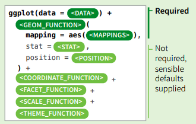
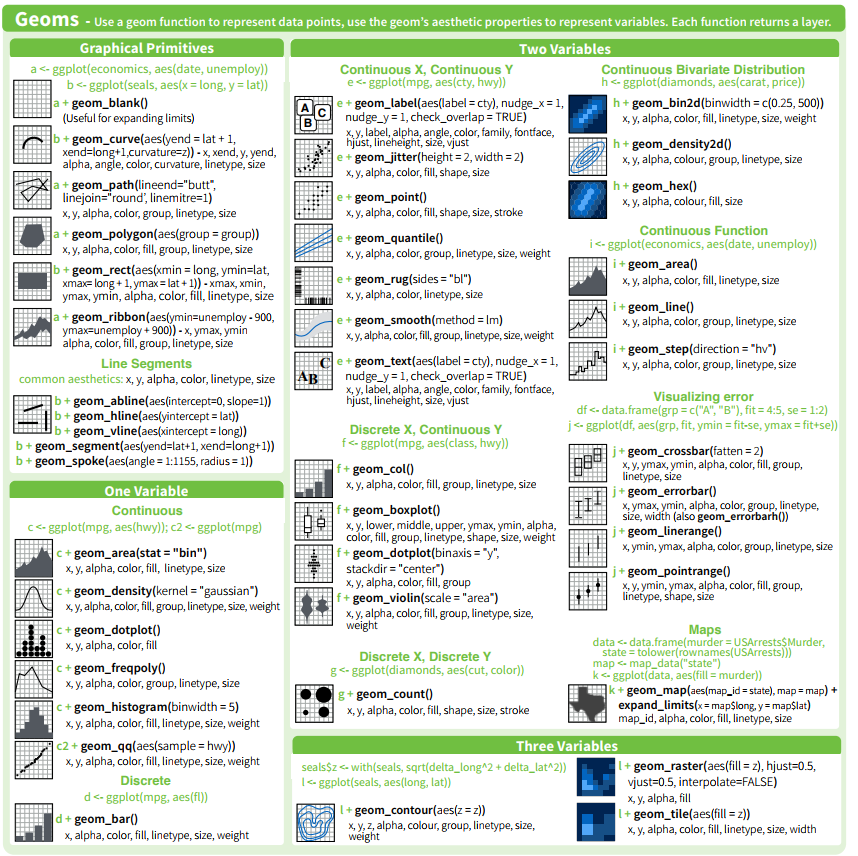
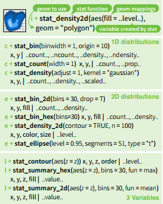
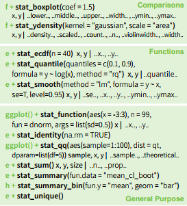

```{r setup, include = F}
library(tidyverse)
library(ggplot2)
library(dplyr)
library(tidyr)
library(gridExtra)
library(ggsci)

options(htmltools.dir.version = FALSE)
knitr::opts_chunk$set(
  cache = TRUE,
	echo = FALSE,
	message = FALSE,
	warning = FALSE
)
```

---
class: center, middle, inverse

# Data Types, Formats, and Structures

---

## Data

Before it is possible to talk about a graphical grammar, it is important to know the type and format of the data you’re working with.  
  
<br/>

--
Why?
--

- the data contains all of the information you’re trying to convey

- the appropriate graphical techniques depend on the kind of data that you are working with

- Working with R and ggplot is much easier if the data you use is in the right shape.

---

## Data: levels of measurement

**Quantitative**:

- Continuous (e.g. height, weight)
- Discrete (e.g. age in years)

**Qualitative**:

- Nominal: categories have no meaningful order (e.g. colors)
- Ordinal: categories have order but no meaningful distance between categories (e.g. five star ratings)

---

## Data: Dimensions, Form, and Type

Dimensions | Forms | Types
----- | ---- | ----
Univariate (1 variable) | Traditional | Count (word freq, scores)
Bivariate (2 variables) | Aggregated | Time Series
Multivariate (3 variables) |  | Spatial 
 | | Time to Event (Survival, Reliability)
 | | Categorical
 
---

## Exploring Relationships

Variables | Plot Type
----- | ---
Continuous vs. Continuous | scatter plot, line plot
Continuous vs. Categorical | boxplots, dotcharts, multiple density plots, violin plots
Categorical vs. Categorical | mosaic plots, side-by-side barplots
Multidimensional | it depends

---
# Tidy Data


ggplot2 assumes your data is tidy.

---
## Untidy data

 *Happy families are all alike; every unhappy family is unhappy in its own way. - Leo Tolstoy*  
<br/>
--

**Five main ways tables of data tend not to be tidy:**

1. Column headers are values, not variable names.

2. Multiple variables are stored in one column.

3. Variables are stored in both rows and columns.

4. Multiple types of observational units are stored in the same table.

5. A single observational unit is stored in multiple tables.

---

## Wide Format vs. Long Format

.pull-left[
**Wide format**

- some variables are spread out across columns.

- typically uses less space to display

- how you would typically choose to present your data

- far less repetition of labels and row elements


]
.pull-right[

**Long format**

- each variable is a column

- each observation is a row

- is likely not the data's most compact form

.center[]

]


---
## Tidy Data

- Use `tidyr` package (mainly `pivot_longer` and `pivot_wider`) to move between long and wide format
- Tidyr Vignette: [pivoting](https://tidyr.tidyverse.org/articles/pivot.html)
- Longer explanation and tutorial: [Pivoting data in R (and SAS)](https://srvanderplas.github.io/unl-stat850/transforming-data.html#pivot-operations)

Longer | Wider
--- | ---
 | 

???

We're not going to specifically cover how to move data from wide to long format, but I will use the pivot functions in some sample code in this workshop, and I've provided links to resources here. For now, what you need to know is more the picture-book version: wider and longer tables look different.


---


---
# ggplot2 basics

Complete the template below to build a graph

) + <geom function>(aes(<mappings>), stat = <stat>, position = <position>)) + <coordinate function> + <scales function> + <facet function> + <theme>, where anything after the geom function statement is optional." style="width:70%"/>


---
## How to build a graph

`ggplot(data = mpg, aes(x = cty, y = hwy))`

- This will begin a plot that you can finish by adding layers to.

- You can add one geom per layer


```{r plots-4, fig.align='bottom', fig.height=5, fig.width=15, echo = F}
p1 <- ggplot(data = mpg, aes(x = class, y = hwy)) + labs(title = "")
p2 <- ggplot(data = mpg, aes(x = class, y = hwy)) + geom_boxplot() + labs(title = "+ geom_boxplot()")
p3 <- ggplot(data = mpg, aes(x = class, y = hwy)) + geom_jitter() + geom_boxplot() + labs(title = "+ geom_jitter() + geom_boxplot()")
grid.arrange(p1, p2, p3, ncol = 3, nrow = 1)
```

```{r, eval = FALSE, purl = TRUE}
ggplot(data = mpg, aes(x = class, y = hwy)) + labs(title = "")
ggplot(data = mpg, aes(x = class, y = hwy)) + geom_boxplot() + labs(title = "+ geom_boxplot()")
ggplot(data = mpg, aes(x = class, y = hwy)) + geom_jitter() + geom_boxplot() + labs(title = "+ geom_jitter() + geom_boxplot()")

```

---
## What is a geom?

In ggplot2, we use a geom function to represent data points, and use the geom's aesthetic properties to represent variables.


```{r, fig.align='top', fig.height=4, fig.width=10, echo = F}
p1 <- ggplot(data = mpg, aes(x = cty, y = hwy, colour = class)) + geom_text(aes(label = class))+ scale_color_locuszoom() +labs(x = "city mpg", y = "highway mpg", title = "Geom Text")
p2 <- ggplot(data = mpg, aes(x = cty, y = hwy, colour = class)) + geom_point()+ scale_color_locuszoom() + labs(x = "city mpg", y = "highway mpg", title = "Geom Point")
grid.arrange(p2, p1, ncol = 2, nrow = 1)
```

```{r, eval = FALSE, purl = TRUE}
ggplot(data = mpg, aes(x = cty, y = hwy, colour = class)) + geom_text(aes(label = class)) + labs(x = "city mpg", y = "highway mpg", title = "Geom Text")

ggplot(data = mpg, aes(x = cty, y = hwy, colour = class)) + geom_point() + labs(x = "city mpg", y = "highway mpg", title = "Geom Point")
```

Once our data is formatted and we know what type of variables we are working with, we can select the correct geom for our visualization. 

---



---
## What is a layer?

- it determines the physical representation of the data

- Together, the data, mappings, statistical transformation, and geometric object form a layer

- A plot may have multiple layers
 
```{r, fig.align='bottom', fig.height=5, fig.width=15}
p1 <- ggplot(data = mpg, aes(x = class, y = hwy, colour = class)) + geom_jitter(width = 0.1) + scale_fill_locuszoom() + scale_color_locuszoom()
p2 <- ggplot(data = mpg, aes(x = class, y = hwy, colour = class)) + geom_violin(aes(fill = class), alpha = 0.4) + scale_fill_locuszoom() + scale_color_locuszoom()
p3 <- ggplot(data = mpg, aes(x = class, y = hwy, colour = class)) + geom_jitter(width = 0.1) + geom_violin(aes(fill = class), alpha = 0.4) + scale_fill_locuszoom() + scale_color_locuszoom()
grid.arrange(p1, p2, p3, ncol = 3, nrow = 1)
```

```{r, eval = FALSE, purl = TRUE}
ggplot(data = mpg, aes(x = class, y = hwy, colour = class)) + geom_jitter(width = 0.1)

ggplot(data = mpg, aes(x = class, y = hwy, colour = class)) + geom_violin(aes(fill = class), alpha = 0.4) 

ggplot(data = mpg, aes(x = class, y = hwy, colour = class)) + geom_jitter(width = 0.1) + geom_violin(aes(fill = class), alpha = 0.4)


```

---
class: inverse
## Your Turn

Change the code below to have the points **on top** of the boxplots.

```{r echo=TRUE, fig.height=4, fig.width=8, purl=TRUE}
ggplot(data = mpg, aes(x = class, y = hwy)) + 
  geom_jitter() + 
  geom_boxplot()
```

---
## Alternative method of building layers: Stats

A stat builds a new variable to plot (e.g., count and proportion)
```{r fig.width=4.5, echo=FALSE, out.width = "48%", fig.show = "hold"}


```

---
class:inverse
## Your turn

Add a smooth line to the following scatterplot:
```{r echo = T, fig.height = 4, fig.width = 8, purl = T}
ggplot(data = mpg, aes(x = cty, y = hwy)) + geom_point()
```


---

## Faceting

A way to extract subsets of data and place them side-by-side in graphics

```{r, fig.width=10, fig.height=4, echo = TRUE, eval=FALSE}
ggplot(data = mpg, 
       aes(x = cty, y = hwy, colour = class)) + 
  geom_point()

ggplot(data = mpg, 
       aes(x = cty, y = hwy, colour = class)) + 
  geom_point() +
  facet_grid(.~class)
```

```{r, fig.width=10, fig.height=4, fig.align = "center", echo=FALSE}
a <- ggplot(data = mpg, aes(x = cty, y = hwy, colour = class)) + geom_point()+ scale_color_locuszoom()

b <- ggplot(data = mpg, aes(x = cty, y = hwy, colour = class)) + geom_point() +theme(legend.position = "none") +facet_grid(.~class)+ scale_color_locuszoom()

grid.arrange(a, b, nrow = 1)
```

---
## Faceting Options

- `facet_grid(. ~ b)`:facet into columns based on b 
- `facet_grid(a ~ .)`:facet into columns based on a 
- `facet_grid(a ~ b)`:facet into both rows and columns
- `facet_wrap( ~ fl)`:wrap facets into a rectangular layout

You can set scales to let axis limits vary across facets:

- `facet_grid(y ~ x, scales = "free")`: x and y axis limits adjust to individual facets
- "free_x" - x axis limits adjust
- "free_y" - y axis limits adjust


---
class:inverse
## Your turn

Find one or more sets of facets that are useful in understanding the relationship between city and highway mileage.

```{r echo = T, fig.height = 4, fig.width = 8, purl = T}
ggplot(data = mpg, aes(x = cty, y = hwy)) + geom_point()
```


---

## Position Adjustments

Position adjustments determine how to arrange geoms that would otherwise occupy the same space
- **Dodge**: Arrange elements side by side 
- **Fill**: Stack elements on top of one another, normalize height
- **Stack**: Stack elements on top of one another

`ggplot(mpg, aes(fl, fill = drv)) + geom_bar(position = "")`

```{r, fig.width=10, fig.height=4, fig.align = "center"}
s <- ggplot(mpg, aes(fl, fill = drv)) +ggtitle("") + scale_fill_locuszoom()
s1 <- s + geom_bar(position = "dodge") +ggtitle("Dodge")
s2 <- s + geom_bar(position = "fill") +ggtitle("Fill") + scale_fill_locuszoom()
s3 <- s + geom_bar(position = "stack") +ggtitle("Stack")

grid.arrange(s1, s2, s3, nrow = 1)

```

---
## Position Adjustments: Jitter

- **Jitter**: Add random noise to X & Y position of each element to avoid overplotting
- There is also a jitter geom 

```{r, fig.width=10, fig.height=4, fig.align = "center"}
p2 <- ggplot(mpg, aes(cyl, hwy, color = factor(cyl))) + geom_point() + ggtitle("geom_point()")+ scale_color_locuszoom()
p3 <- ggplot(mpg, aes(cyl, hwy, color = factor(cyl))) + geom_point(position = "jitter") + ggtitle('geom_point(position = "jitter")')+ scale_color_locuszoom()
p4 <- ggplot(mpg, aes(cyl, hwy, color = factor(cyl))) + geom_jitter() + ggtitle("geom_jitter()")+ scale_color_locuszoom()
grid.arrange(p2, p3, p4, nrow = 1)
```

---
## Coordinate Systems

- `coord_cartesian()`: The default cartesian coordinate system
- `coord_fixed()`: Cartesian with fixed aspect ratio between x & y units
- `coord_flip()`: Flipped Cartesian coordinates
- `coord_polar()`: Polar coordinates
- `coord_trans()`: Transformed cartesian coordinates.
- `coord_map()`: Map projections from the mapproj package (mercator (default), azequalarea, lagrange, etc.)

```{r, fig.width=10, fig.height=4, fig.align = "center", eval = FALSE}
r <- ggplot(mpg, aes(fl)) + geom_bar()
r + coord_cartesian(xlim = c(0, 5))
r + coord_fixed(ratio = 1/10)
r + coord_flip()
r + coord_trans(y = "sqrt")
r + coord_polar(theta = "x", direction=1 )
z + coord_map(projection = "ortho")
z + coord_map(projection = "ortho", orientation = c(-90, 0, 0))
```

```{r, fig.width=10, fig.height=5, fig.align = "center"}
r <- ggplot(mpg, aes(fl)) + geom_bar()
r1 <- r + coord_cartesian(xlim = c(0, 5)) + ggtitle("coord_cartesian")
r2 <- r + coord_fixed(ratio = 1/10) + ggtitle("coord_fixed")
r3 <- r + coord_flip() + ggtitle("coord_flip")
r4 <- r + coord_polar(theta = "x", direction=1 ) + ggtitle("coord_polar")
r5 <- r + coord_trans(y = "sqrt") + ggtitle("coord_trans")
world <- map_data("world")
library(maps)
worldmap <- ggplot(world, aes(x = long, y = lat, group = group)) +
  geom_path() +
  scale_y_continuous(breaks = (-2:2) * 30) +
  scale_x_continuous(breaks = (-4:4) * 45)
r7 <- worldmap + coord_map("ortho") + ggtitle("coord_map")
r8 <- worldmap + coord_map("ortho", orientation = c(-90, 0, 0)) + ggtitle("coord_map")

grid.arrange(r1, r2, r3, r5, r4, r7, r8, nrow = 2)
```


---

## ggplot2 extenstions

- https://exts.ggplot2.tidyverse.org/

<iframe src="https://exts.ggplot2.tidyverse.org/gallery/" width="100%" height = "500px"/>

