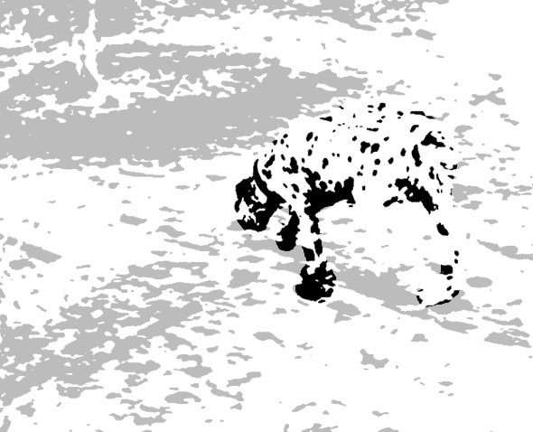
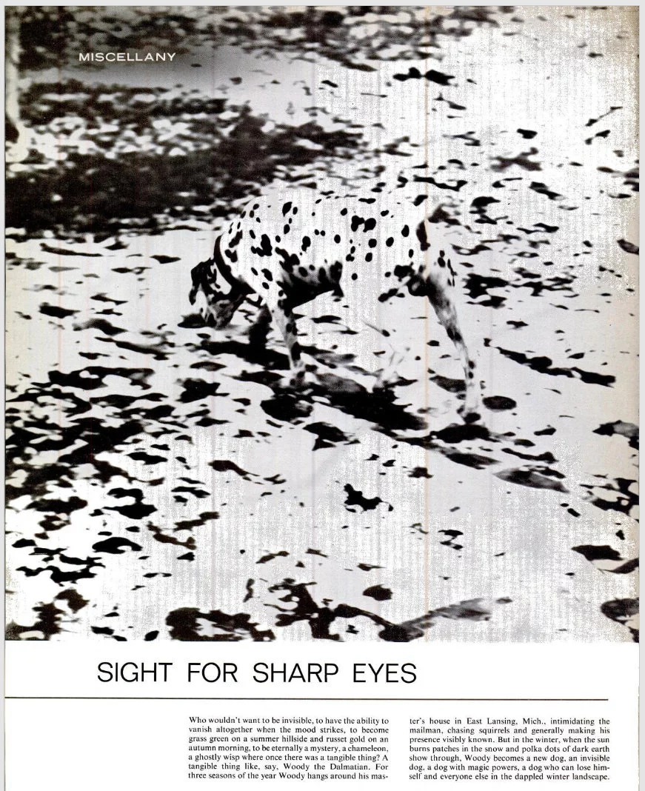
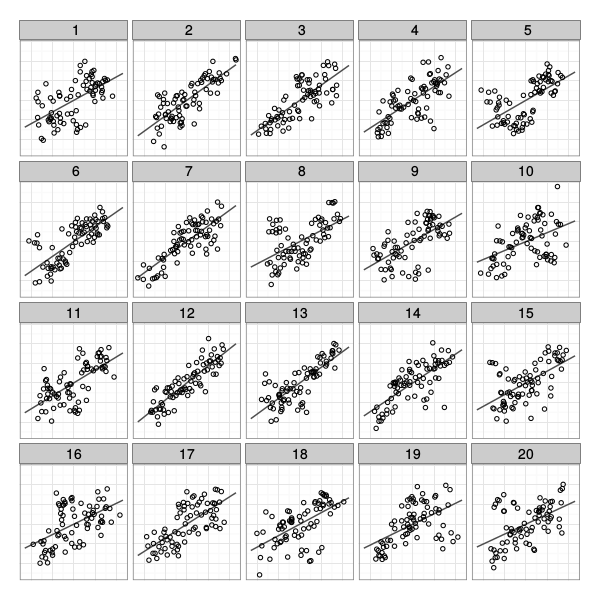
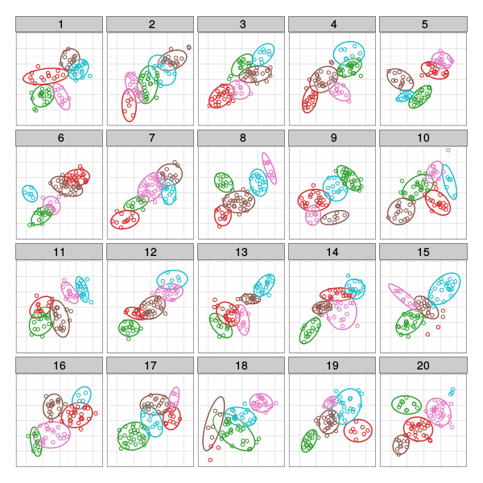
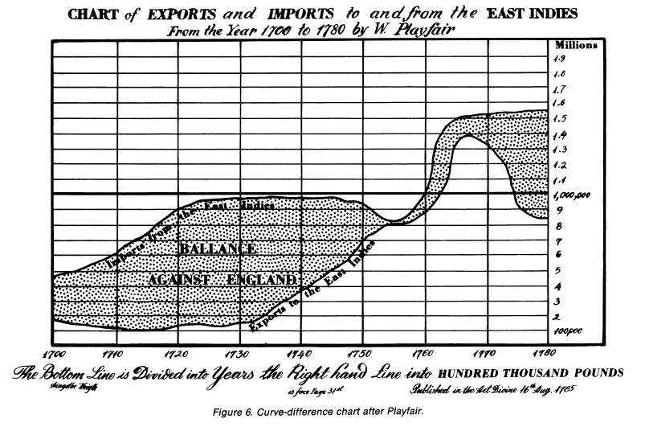
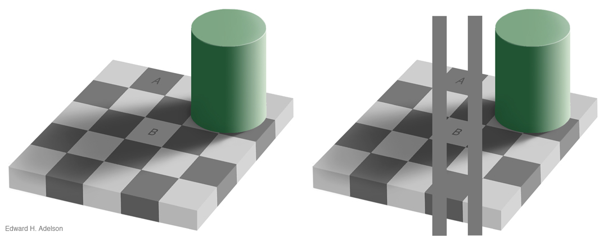
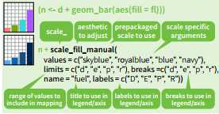
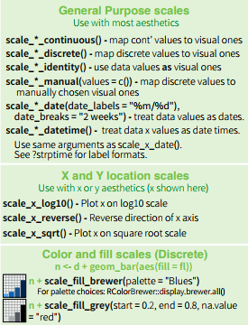
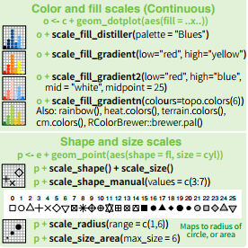

```{r setup, include = F}
library(tidyverse)
library(ggplot2)
library(dplyr)
library(tidyr)
library(gridExtra)
library(ggsci)
```

```{r knitr-setup, include = F, purl = F}
options(htmltools.dir.version = FALSE)
knitr::opts_chunk$set(
  cache = TRUE,
	echo = FALSE,
	message = FALSE,
	warning = FALSE
)
```
class:middle,center,inverse
# Introduction
---
## What do you see?

.center[

]
.bottom[Image source: https://www.moillusions.com/mysterious-dots-optical-illusion/]

---
## What do you see?

.center[

]

???

Vision, in general, involves a *lot* of unconscious pattern recognition. If we can harness that power, we can show people data in a way that doesn't require a lot of thought for them to engage with the data.

---
## It's not just an illusion - it's a photo

.center[

]

.bottom[Life Magazine, 19 Feb 1965]

---
## Why Graphics Matter
Graphics are a form of **external cognition** that allow us to think about the **data** rather than the **chart**

--

Good graphics take advantage of how the brain works

- preattentive processing

- perceptual grouping

- awareness of visual limitations

---
## Good Graphics

In good graphics, the 

1. graph form
2. data (and structure)
3. aesthetics

all work together to pass information to the brain via the visual system.

--

The **structure** and **aesthetics** used to create the chart should contribute to the understanding of what is being shown!

---
## Bad Graphics

<iframe src="https://xkcd.com/1138/#comic" width="800px" height="560px"/>

???

Of course, even decent visualizations can't compensate for lousy data... or rather, chart designers who aren't thinking about how to represent the data well.

---
## Bad Graphics


.center[]


.bottom[https://en.wikipedia.org/wiki/File:Processor_families_in_TOP500_supercomputers.svg]

???

But perfectly reasonable data can also be ruined by bad aesthetic choices.

As with anything, graphics require a combination of "art" and "science" - you not only have to use the best method to display the data (which this isn't, necessarily), you also have to use some judgment as to how to show what you're hoping to show... and this is a good example of what happens when that doesn't happen. 


---
## Spot the Difference

```{r preattentive1,echo=FALSE,include=T, fig.width=4, fig.height=4, out.width = "49.5%", purl = F}
set.seed(153253)
data <- data.frame(expand.grid(x=1:6, y=1:6), color=sample(c(1,2), 36, replace=TRUE))
data$x <- data$x+rnorm(36, 0, .25)
data$y <- data$y+rnorm(36, 0, .25)
suppressWarnings(library(ggplot2))
new_theme_empty <- theme_bw()
new_theme_empty$line <- element_blank()
# new_theme_empty$rect <- element_blank()
new_theme_empty$strip.text <- element_blank()
new_theme_empty$axis.text <- element_blank()
new_theme_empty$plot.title <- element_blank()
new_theme_empty$axis.title <- element_blank()
# new_theme_empty$plot.margin <- structure(c(0, 0, -1, -1), unit = "lines", valid.unit = 3L, class = "unit")

data$shape <- c(rep(2, 15), 1, rep(2,20))
library(scales)
qplot(data=data, x=x, y=y, color=factor(1, levels=c(1,2)), shape=factor(shape), size=I(5))+scale_shape_manual(guide="none", values=c(19, 15)) + scale_color_discrete(guide="none") + new_theme_empty

data$shape <- c(rep(2, 25), 1, rep(2,10))
qplot(data=data, x=x, y=y, color=factor(shape), shape=I(19), size=I(5))+scale_shape_manual(guide="none", values=c(19, 15)) + scale_color_discrete(guide="none") + new_theme_empty
```

---
## Spot the Difference

```{r preattentive2,echo=FALSE,include=T, fig.width=4, fig.height=4, out.width = "49.5%", purl = F}
set.seed(1532534)
data <- data.frame(expand.grid(x=1:6, y=1:6), color=sample(c(1,2), 36, replace=TRUE))
data$x <- data$x+rnorm(36, 0, .25)
data$y <- data$y+rnorm(36, 0, .25)
suppressWarnings(library(ggplot2))
new_theme_empty <- theme_bw()
new_theme_empty$line <- element_blank()
# new_theme_empty$rect <- element_blank()
new_theme_empty$strip.text <- element_blank()
new_theme_empty$axis.text <- element_blank()
new_theme_empty$plot.title <- element_blank()
new_theme_empty$axis.title <- element_blank()
# new_theme_empty$plot.margin <- structure(c(0, 0, -1, -1), unit = "lines", valid.unit = 3L, class = "unit")

data$shape <- data$color
qplot(data=data, x=x, y=y, color=factor(color), shape=factor(shape), size=I(5))+scale_shape_manual(guide="none", values=c(19, 15)) + scale_color_discrete(guide="none") + new_theme_empty


data$shape[1] <- if(data$shape[1]==2) 1 else 2
qplot(data=data, x=x, y=y, color=factor(color), shape=factor(shape), size=I(5))+scale_shape_manual(guide="none", values=c(19, 15)) + scale_color_discrete(guide="none") + new_theme_empty
```

---
## Preattentive perception 

- Occurs automatically (no effort)

- Color, shape, angle 

- Combinations of preattentive features require attention
    - Unless you double-encode    
    (use different features for the same variable)


--

Using preattentive features reduces the amount of work your viewer has to expend to understand your chart

---
## What do you see?

.center[]

???

What do you see here? 3 pac-men shapes and 3 acute angles? No? 

I see 3 circles, a triangle with a black outline, and a white triangle with no outline.  But... that's not really what's there, is it?

I'll talk next about the Gestalt laws, but if you can't remember them, just remember this saying - "The whole is greater than the sum of the parts" - just as here, what we see is more orderly than what is actually there.

---
class: center, middle, inverse

# Gestalt Principles
### What sorts of relationships are inferred, and under what circumstances? 

---
## Gestalt Laws of Perception

.center[]

???

The Gestalt laws are a set of rules for how we interpret ambiguity in the visual scene. 

The law of Closure says that it's easier to interpret things if you imagine them as a closed figure - it's more likely that a closed figure is for instance obstructed, than that it is a set of more complex, less meaningful figures. This is sometimes also stated as the "law of good figure"

the law of Proximity says that things that are close together are likely part of the same unit. So you might interpret things as a dalmation instead of a series of blobs of black ink. 

The law of continuation says that figures with edges that are smooth are more likely to be continuous than things with edges that are sharp angles. 

the law of similarity says that things are likely to be viewed as part of a group if they look similar. 

Then, the law of figure/ground helps explain why we see both the tree and the AL figure combination here - we have contextual information that helps us simplify the picture into two groups - the figure (the tree), and the background (the AL); thus also helps us separate the AL from the white background behind it. 

There are a few other gestalt laws, but these are the main ones.

Now, let's talk about how these laws apply to charts! I swear, I didn't forget that I am supposed to be talking about data visualization.

---
## Gestalt Laws in Data Visualization

```{r, fig.width = 8, fig.height = 4, out.width = "100%", purl = F}
tmp <- tibble(x = c(-1, 0, 1), y = c(1, -1, 1), group = c(1, 2, 3)) %>%
  mutate(x = purrr::map(x, rnorm, n = 100, sd = .75), 
         y = purrr::map(y, rnorm, n = 100, sd = .75)) %>%
  unnest(x, y) 

library(gridExtra)
grid.arrange(
ggplot(tmp, aes(x = x, y = y, shape = factor(group))) + geom_point() + guides(shape = "none") + theme_minimal() + theme(axis.title = element_blank(), axis.text = element_blank()) + coord_fixed(),
ggplot(tmp, aes(x = x, y = y, color = factor(group))) + geom_point() + guides(color = "none") + theme_minimal() + theme(axis.title = element_blank(), axis.text = element_blank()) + coord_fixed(),
nrow = 1)

```

- Proximity

- Similarity


---
## Gestalt Laws in Data Visualization

```{r, fig.width = 8, fig.height = 4, out.width = "100%"}

tmp <- tibble(g1 = 1, x = seq(-2, 2, .01), y = -sin(pi*x)) %>%
  bind_rows(tibble(x = seq(-2, 2, .01), y = 0, g1 = 2)) %>%
  mutate(color = factor(floor(x)), size = as.numeric(color) %% 2)

ggplot(tmp, aes(x = x, y = y, group = g1)) + geom_line() + scale_size_continuous(range = c(.75, 1.25)) + guides(size = "none", color = "none") + theme_minimal() + theme(axis.title = element_blank(), axis.text = element_blank()) + coord_fixed()
```

---
## Gestalt Laws in Data Visualization


```{r, fig.width = 8, fig.height = 4, out.width = "100%", purl = F}
grid.arrange(
ggplot(tmp, aes(x = x, y = y, group = g1, color = color, size = size)) + geom_line() + scale_size_continuous(range = c(.75, 1.25)) + guides(size = "none", color = "none") + theme_minimal() + theme(axis.title = element_blank(), axis.text = element_blank()) + coord_fixed(),

ggplot(tmp, aes(x = x, y = y, group = g1, color = g1, size = g1)) + geom_line() + scale_size_continuous(range = c(.75, 1.25)) + guides(size = "none", color = "none") + theme_minimal() + theme(axis.title = element_blank(), axis.text = element_blank()) + coord_fixed(),
nrow = 1)
```

- Good continuation

---
## Which one is different?

.center[]

---
## Which one is different?

.center[]

---
## Plot Annotations Matter!

.pull-left[

.center[]

- Plot 12: 59.1% 
- Plot 5:  9.1% 
- Other plots: 31.7% 

]
.pull-right[

.center[]

- Plot 12: 9.7%
- Plot 5: 29.0% 
- Plot 18: 32.3% 
- Other plots: 29.0% 

]

???

Add annotations to your plots based on what you want to emphasize. If you want to show the trend (or deviations from it), add a line and maybe a confidence band. If you want to show clustering, use ellipses and color and/or shape. 

What you add to the plot helps to determine what people will see in the data!

---
class:middle,center,inverse
# Visual Limitations


---
## Visual Limitations

- Not all graphical representations are equally accurate

- Optical illusions 

- Designing plots for disabilities

- Color choices

---
## Accuracy of Graphical Judgements

1. Position along a common scale (most accurate)
    - scatter plot
2. Position along nonaligned scale
    - multiple scatter plots
3. Length
    - bar chart
4. Angle, Slope
    - pie chart
5. Area
    - bubble chart
6. Volume, Density, Color saturation
    - heatmap
7. Color hue (least accurate)


???

When you design a visualization, try to make the most important variables represented by dimensions that are accurate.

In some cases, we only care about relative accuracy - for those, things like color saturation are fine for encoding information. 

You may have heard people talk about how awful pie charts are - that's because anything that can be put into a pie chart can also be put into a bar chart, which will be read more accurately. 

---
## Optical Illusions



???

We're really bad at judging vertical distance, as well. If you need to show the difference between two curves, you should attempt to find a different way to do it than showing both curves on the same chart - for instance, plot the difference alongside the two curves.


---
## Designing for Accessibility

- Low visual acuity:
    - High contrast (bright/dark)
    - large font size
    - textures/patterns can be hard to make out

- Colorblindness:
    - Safest: design for a black-and-white photocopier
    - Avoid rainbow gradients
    - If you need a 2-color gradient, use blue/purple - white - orange (safe for most types of colorblindness)
    
- R packages for accessibility
    - ajrgodfrey/BrailleR - translate plots into text descriptions for screen readers
    - sonify - represent data using sound
    - gt - tables with metadata that is easy for screen readers

???

Unfortunately, there is relatively little research on other disabilities + statistical graphics

---
## Color

- **Hue**: shade of color (red, orange, yellow...)

- **Intensity**: amount of color

- Both color and hue are pre-attentive. Bigger contrast corresponds to faster detection.

- Use color to your advantage

- When choosing color schemes, we will want mappings from data to color that are not just numerically but also ***perceptually*** uniform

- Distinguish between sequential scales and categorical scales

---

## Color

Color is context-sensitive: A and B are the same intensity and hue, but appear to be different.



---

## Ordering Variables

Which is bigger?

- Position: higher is bigger (y), items to the right are bigger (x)
- Size, Area
- Color: not always ordered. More contrast = bigger.
- Shape: Unordered. 

```{r, echo=FALSE, fig.width=20, purl = F}
library(RColorBrewer)
library(gridExtra)

data <- data.frame(x = c(1, 2, 3, 4, 5), 
                   y = c(1, 4, 9, 10, 12), 
                   size = c(1, 4, 2, 1, 5))

p1 <- qplot(x, y, data = data, size = size, geom = "point") + 
    scale_size_continuous(range = c(2.5, 5), guide = "none") + 
    theme_bw()  + 
    theme(axis.text = element_blank())

data <- data.frame(x = factor(c(1, 2, 3, 4, 5)), 
                   y = c(4, 3, 1, 5, 2))

p2 <- ggplot(data = data, aes(x = x, weight = y)) + 
    geom_bar() + 
    theme_bw() + 
    theme(axis.text = element_blank())

data <- data.frame(expand.grid(x = 1:6, y = 1:2), 
                   color = c(brewer.pal(7, "Blues")[2:7], 
                             brewer.pal(6, "Set1")))

p3 <- ggplot(data = data, aes(x = x, y = factor(y), color = color)) + 
    geom_point(size = 5) + 
    scale_color_identity() + 
    ylab("") + 
    xlab("") + 
    theme_bw() + 
    theme(axis.text = element_blank())

grid.arrange(p1, p2, p3, nrow = 1)
```

---
class: center, middle, inverse

# Aesthetics in `ggplot2`: Scales

---

## Aesthetics in `ggplot2`

**Aesthetics**: features such as color, shape, and size that map other characteristics to structural features

**Scales** map data values to the visual values of an aesthetic  

 - to change a mapping, add a new scale

```{r fig.width=6, echo=FALSE, fig.align = "center"}

```

---
## Scales

.pull-left[
```{r fig.width=4.5, echo=FALSE, fig.align = "top", purl = F}

```
]
.pull-right[
```{r fig.width=4.5, echo=FALSE, fig.align = "top", purl = F}

```
]

---
## Gradients

Qualitative schemes: no more than 7 colors


```{r, echo=FALSE, fig.width=7, fig.height=1.2, purl = F}
data <- data.frame(x = 1:7, 
                   blues = brewer.pal(7, "Blues"), 
                   set1 = brewer.pal(7, "Set1"), 
                   diverge = brewer.pal(7,"RdBu"))

qplot(xmin = x-.5, xmax = x+.5, ymin = 0, ymax = 1, data = data, geom = "rect", color = I("black"), fill = set1) + 
    scale_fill_identity() + 
    ylab("") + 
    xlab("") + 
    theme(axis.text = element_blank(), 
          axis.ticks = element_blank(), 
          rect = element_blank()) + 
    coord_fixed(ratio = 1) + 
    theme_void()
```

<small>
Can use `colorRampPalette()` from the RColorBrewer package to produce larger palettes by interpolating existing ones
</small>

```{r, echo=FALSE, fig.width=10, fig.height=1.2, purl = F}

getPalette = colorRampPalette(brewer.pal(9, "Set1"))

data2 <- data.frame(x = 1:20, 
                   expanded = getPalette(20))

qplot(xmin = x-.5, xmax = x+.5, ymin = 0, ymax = 1, data = data2, geom = "rect", color = I("black"), fill = expanded) + 
    scale_fill_identity() + 
    ylab("") + 
    xlab("") + 
    theme(axis.text = element_blank(), 
          axis.ticks = element_blank(), 
          rect = element_blank()) + 
    coord_fixed(ratio = 1) + 
    theme_void()
``` 

Quantitative schemes: use color gradient with only one hue for positive values

```{r, echo=FALSE, fig.width=7, fig.height=1.2, purl = F}
qplot(xmin = x-.5, xmax = x+.5, ymin = 0, ymax = 1, data = data, geom = "rect", color = I("black"), fill = blues) + 
    scale_fill_identity() + 
    ylab("") + 
    xlab("") + 
    theme(axis.text = element_blank(), 
          axis.ticks = element_blank(), 
          rect = element_blank()) + 
    coord_fixed(ratio = 1) + 
    theme_void()
```

---

## More Gradients

Quantitative schemes: use color gradient with two hues for positive and negative values. Gradient should go through a light, neutral color (white)

```{r, echo=FALSE, fig.width=7, fig.height=1.5, purl = F} 
qplot(xmin = x-.5, xmax = x+.5, ymin = 0, ymax = 1, data = data, geom = "rect", color = I("black"), fill = diverge) + 
    scale_fill_identity() + 
    ylab("") + 
    xlab("") + 
    theme(axis.text = element_blank(), 
          axis.ticks = element_blank(), 
          rect = element_blank()) + 
    coord_fixed(ratio = 1) + 
    theme_void()
``` 

Small objects or thin lines need more contrast than larger areas

---
## Factors vs. Continuous variables

- Factor variable:
    - `scale_colour_discrete`
    - `scale_colour_brewer(palette = ...)`
- Continuous variable:
    - `scale_colour_gradient` (define low, high values)
    - `scale_colour_gradient2` (define low, mid, and high values)
    - Equivalents for fill: `scale_fill_...`

```{r, fig.align='top', fig.height=4, fig.width=10, purl = F}
p1 <- ggplot(data = mpg, aes(x = cty, y = hwy, colour = class)) + geom_point() + scale_color_locuszoom() +labs(x = "city mpg", y = "highway mpg", title = "Factor variable")
p2 <- ggplot(data = mpg, aes(x = cty, y = hwy, colour = hwy)) + geom_point() + labs(x = "city mpg", y = "highway mpg", title = "Continuous variable")
grid.arrange(p1, p2, ncol = 2, nrow = 1)
``` 

---
## Color in ggplot2

- There are packages available (`ggsci`, `viridis`, `wesanderson`, `RColorBrewer`) that have color schemes for any occasion.

```{r color-ggplot2, fig.width = 10, fig.height = 5, out.width = "100%"}
library(ggsci)
library(viridis)
library(wesanderson)
library(RColorBrewer)

p1 <- ggplot(data = mpg, aes(x = class, fill = class)) + geom_bar() +
  theme_bw() +theme(legend.position = "none", axis.text.x = element_blank())
  
p11 <- p1 + labs(title= "ggplot2 default")
p2 = p1 + scale_fill_npg() + labs(title = "NPG")
p3 = p1 + scale_fill_startrek() + labs(title = "Star Trek")
p4 = p1 + scale_fill_ucscgb() + labs(title = "UCSCGB")
p5 = p1 + scale_fill_viridis(discrete = TRUE) + labs(title = "Viridis")
p6 = p1 + scale_fill_viridis(option="magma", discrete = TRUE) + labs(title = "Magma")
#p7 = p1 + scale_color_manual(values = wes_palette(4, "Rushmore")) + labs(title = "Rushmore")
#p8 = p1 + scale_color_manual(values = wes_palette(5, "Zissou")) + labs(title = "Zissou")
p9 = p1 + scale_fill_brewer(palette="Set2") + labs(title = "Set2")
p0 = p1 + scale_fill_brewer(palette="Dark2") + labs(title = "Dark2")

grid.arrange(p11, p2, p3, p4, p5, p6, #p7, p8, 
             p9, p0, nrow = 2)

```
  
  

---
class: inverse
## Your Turn 

```{r, echo = T, purl = T}
data(diamonds)
```

- In the diamonds data, clarity and cut are ordinal, while price and carat are continuous

- Find a graphic that gives an overview of these four variables while respecting their types


---
class: inverse
## Your Turn 2

The `movies` data set contains information from IMDB.com including ratings, genre, length in minutes, and year of release.

```{r, echo = TRUE, purl = T}
movies <- read.csv("http://heike.github.io/summerschool-2021/02-graphics/data/MovieSummary.csv")
```
                   

- Explore the differences in length, rating, etc. in movie genres over time
- Hint: use facetting!

---
class:middle,center,inverse
# Additional Resources

---
## Additional Resources

- Maps in ggplot2
  - [ggplot2 book chapter](https://ggplot2-book.org/maps.html)
  - [Mapping with ggplot2 (Workshop)](https://kelseyandersen.github.io/DataVizR/mapping.html)
  - [r-spatial ggplot2 maps tutorial](https://r-spatial.org/r/2018/10/25/ggplot2-sf.html)

- General references
  - [R graphics Cookbook](https://r-graphics.org/)
  - [Data Visualization Catalogue](https://datavizcatalogue.com/)

